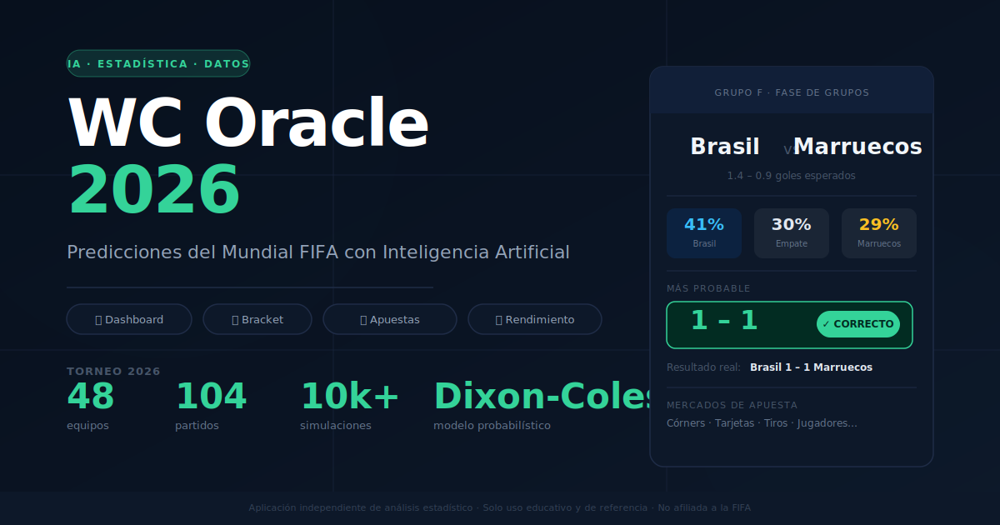
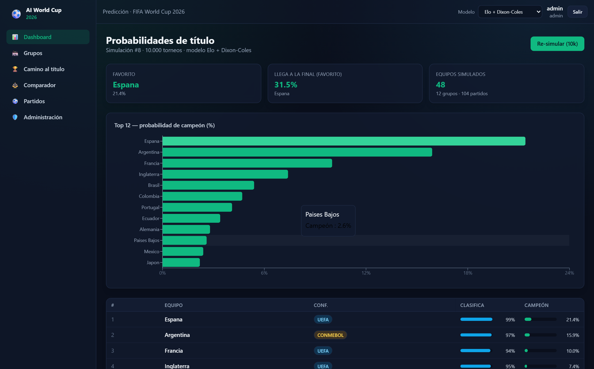
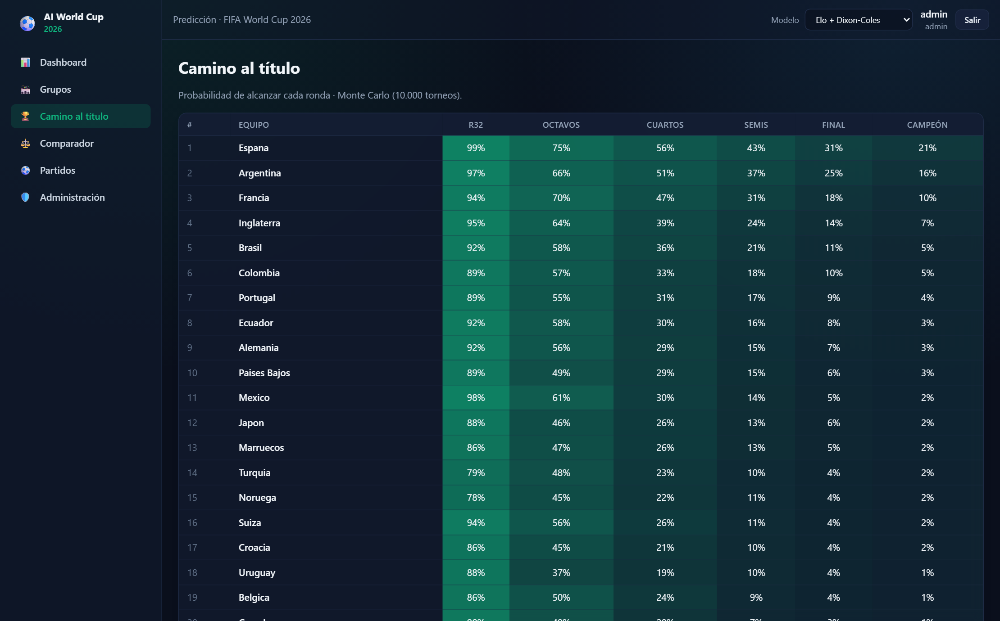
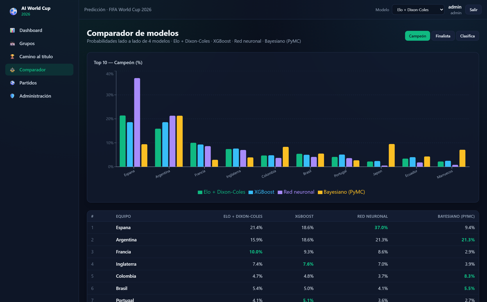
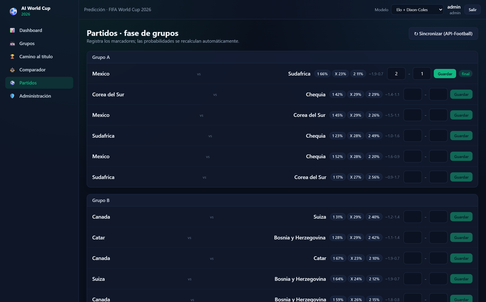

<p align="center">
  
</p>

# WC Oracle 26 — FIFA World Cup 2026 AI Prediction Platform

Full-stack web platform that estimates **FIFA World Cup 2026 outcome probabilities** — match result (1X2), scoreline, stage advancement and title — and lets you **record real results** to recalculate probabilities live throughout the tournament.

> World Cup 2026: 48 teams · 12 groups (A–L) · 104 matches · Jun 11 – Jul 19 · USA/Mexico/Canada.

## ✨ Highlights

- **4 selectable prediction models**: custom **Elo** → expected goals → **Dixon-Coles** (bivariate Poisson), **XGBoost** (dual Poisson regressors), **neural network** (PyTorch, team embeddings + Poisson MLP) and **hierarchical Bayesian** (PyMC/ADVI) — all feeding a **Monte Carlo simulator (10k runs)** over the **official FIFA bracket** (Annex C third-place assignment solved with bipartite matching, all 495 combinations validated).
- **Live sync**: results pulled automatically from football-data.org (free tier covers WC 2026) via an APScheduler job; knockout rounds materialize themselves as groups close.
- **Dynamic RBAC**: configurable profiles, granular permissions, per-profile user quotas.
- **Model comparator**: side-by-side metrics (RPS, log-loss, Brier) plus Bayesian credible intervals per team.
- **Backtested** on ~50k historical internationals with a temporal split — RPS ≈ 0.169–0.189 depending on the model.

## 📸 Screenshots

| Dashboard | Bracket — Road to the Title |
|---|---|
|  |  |

| Model comparator | Match tracker |
|---|---|
|  |  |

## 🏗️ Architecture

```
[Clients] --HTTPS--> [Server B: Caddy + React SPA] --/api--> [Server A: FastAPI + ML + SQLite + scheduler]
```

- **Server A** runs all the compute: FastAPI backend, the four ML models, SQLite and the live-sync scheduler.
- **Server B** (any Linux box with Docker) serves the React build and reverse-proxies `/api/*` to Server A.
- Single-server deployment works too — see [DEPLOYMENT.md](DEPLOYMENT.md).

## 📁 Structure

```
backend/   FastAPI API, ORM models (incl. RBAC), ingestion, scheduler
ml/        Elo, Dixon-Coles, XGBoost, neural net, Bayesian, Monte Carlo, backtesting
frontend/  React + TypeScript + Vite SPA (dark sports theme, ES)
deploy/    docker-compose (A & B) + Caddyfiles
data/      seed/ (groups, schedule)
docs/      architecture and technical notes
scripts/   smoke tests and data checks
```

## 🚀 Quick Start (development)

```bash
# 1) Python environment
python -m venv .venv && source .venv/bin/activate   # Windows: .\.venv\Scripts\Activate.ps1
pip install -r backend/requirements.txt

# 2) Configuration
cp .env.example .env        # set SECRET_KEY and ADMIN_PASSWORD

# 3) Data + base training (downloads historicals, computes Elo, fits Dixon-Coles)
python -m ml.train
# Optional: python -m ml.train --models --bayes   (XGBoost, NN, Bayesian)

# 4) API
uvicorn backend.app.main:app --reload --port 8000
# Interactive docs: http://localhost:8000/docs
```

### Frontend (Node 20+)

```bash
npm install --prefix frontend
npm run dev --prefix frontend        # http://localhost:5173 (proxies /api to :8000)
```

Log in with the admin user defined in `.env` (`admin` / `admin123` by default — **change it before any real deployment**).

### Live sync (optional)

Set `FOOTBALL_DATA_ORG_TOKEN` in `.env` (free tier covers 2026) and the scheduler will apply results, materialize knockouts and retrain all models automatically. Verify your token with `python scripts/check_footballdata.py`.

## 🧪 Verification

```bash
python -m ml.verify_core          # ML core smoke test
python scripts/smoke_api.py       # end-to-end API smoke test
python scripts/smoke_models.py    # multi-model pipeline
python scripts/smoke_knockouts.py # knockout materialization (isolated temp DB)
```

## 📦 Distributed deployment

Step-by-step guide in [DEPLOYMENT.md](DEPLOYMENT.md) (Server A + Server B, firewall, TLS, verification). Architecture details: [docs/architecture.md](docs/architecture.md).

## 📄 License

MIT
